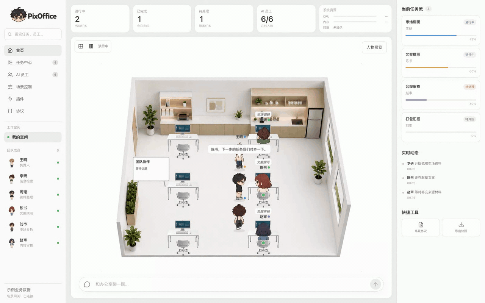

# PixOffice

**简体中文** · [English](./README.en.md)

[官网：pixoffice.online](https://pixoffice.online/?lang=zh)

[完整办公室](https://pixoffice.online/office/) · [最小装配](https://pixoffice.online/minimal/) · [教室](./example/classroom/README.md) · [农场](./example/farm/README.md)



当前版本的场景演示：多人走动、工位拜访与对话。[查看高清静态预览](./docs/page-preview.jpeg)。

PixOffice 是独立的二维办公室前端项目，采用 Vite + React + Pixi。页面采用可替换的业务数据源展示指标、任务与员工；场景内核通过版本化协议和可信内置插件驱动人物、物品与活动。未接入业务服务时使用明确标识的示例数据。

保留原有人物帧动画、坐姿和办公室素材，支持工位拜访、多人会议、持续专注、白板内容、插件启停和网格拖放布局。

地图与人物行走统一使用整数格。办公室默认人物 1×1 格、桌椅 2×2 格、白板 2×1 格；教室使用独立的家具占地规格。家具通过入口格、使用格和资源预约驱动互动；平滑动画只在渲染层插值。当前命令协议为 `2.0`，详见[整数格与家具互动](./docs/integer-grid-and-interactions.md)。

[业务页面数据接入](./docs/dashboard-integration.md) · [插件架构、场景协议与外部接入](./docs/plugin-runtime.md) · [地图编辑器与 AI 编辑协议](./docs/map-editor.md) · [长期协议设计草案](./docs/scene-protocol-v1.md)

[场景扩展与动画架构](./docs/architecture/README.md)：办公室、教室与农场平级独立，复用公共运行时和帧动画适配器。农场支持播种、浇水、生长、采收和双农夫自动照料。骨骼引擎尚未实现。

## 包与示例

项目使用 npm workspaces，共十个包。四个通用包：`contracts` 公共契约、`runtime` 核心运行时、`renderer-pixi` 渲染宿主、`animation-frame` 帧播放器。三个场景分别由 `scene-office` / `assets-office`、`scene-classroom` / `assets-classroom`、`scene-farm` / `assets-farm` 组成，场景之间不互相依赖。

- [完整办公室](./example/office-web)：保留当前 React 界面、聊天、编辑器与 HTTP 接入。
- [最小装配](./example/minimal-vanilla)：只通过公开包入口拼装办公室，不依赖 React。
- [独立场景](./example/isolated-scene)：不安装办公室包，只装配一个可行走人物；`npm run dev:isolated`。
- [独立教室](./example/classroom)：教师讲课、学生回答、黑板更新；`npm run dev:classroom`。独立部署用 `npm run build:classroom`，产物不含办公室资源。
- [独立农场](./example/farm)：2 位农夫、6 块菜地、3 种蔬菜和种植闭环；`npm run dev:farm`。独立部署用 `npm run build:farm`，不携带办公室或教室资源。本地存档，离线暂停生长。
- [架构与分工](./docs/architecture/README.md)：依赖方向、资源交付、骨骼/场景开发入口。

`npm run packages:build` 构建包；`npm run packages:check` 检查边界；`npm run packages:smoke` 将 tgz 安装到仓库之外验证。代码包目前只在仓库内开发，未发布 npm。素材独立部署，可用 `npm run assets:export -- /absolute/path/to/new-public-directory` 导出。

场景通过 `SceneAssembly` 按需装配；家具和各人物可按版本清单单独导出，详见[场景隔离与按需交付](./docs/architecture/scene-isolation.md)。独立示例使用自己的 public 目录，完整官网仍包含办公室资源。

## 办公室对话

动画区域底部提供悬浮输入框。发送消息后，对话面板向上展开；生成时输入框显示流动彩色边框，支持停止、收起和新建对话。默认是明确标注的交互预览，不调用模型或执行任务。通过 `VITE_PIXOFFICE_CHAT_URL` 或 `OfficeApp` 的 `chatSource` 接入真实流式服务，详见[聊天接入协议](./docs/chat-integration.md)。

## 地图编辑

办公室左上角网格按钮进入全屏「布置办公室」：从底部家具目录选取素材，拖动家具并吸附地面网格，选中后可复制、收起或调整工位所属人物。非法摆放自动回原位；支持撤销 / 重做，高级菜单提供 JSON 导入导出与路线测试。外部 AI 可通过同一套 `map.edit` 协议修改共享草稿，不需要模拟鼠标。

## 人物资源包

现有六个人已迁移为独立资源包：`art/characters/packs/<人物ID>/`。每个动作独立维护，构建时自动生成图集、帧坐标和人物注册表，办公室与预览共用尺寸、锚点和动作采样协议。

```bash
npm run characters:build  # 检查准入并打包正式人物
npm run characters:check  # 校验源素材与生成资源是否一致
```

`npm run dev`、`npm run build`、`npm test` 会先自动打包。人物图集和首屏办公室素材采用无损 WebP，保留原始 PNG、帧坐标和动作时序。生成目录 `public/characters/` 与办公室生成的 `.webp` 不纳入 Git；旧图集保留为来源记录，正常帧动画不再直接加载它们。

首次打开先绘制白底与办公室背景，人物首屏包（坐姿、工作帧）、桌椅并行加载（普通纹理最多 4 个并发，背景独立优先加载），显示实际资源完成数量。侧栏头像使用独立小图，不拉取完整动作图集。保存场景中的其他当前姿态按需补齐，旧版未分组图集仍兼容。

办公室可见后继续播放当前工作动作，后台准备走路、对话和表情等完整动作；准备完成后开放互动、演示、编辑入口及场景网关。失败时保留已显示画面，并提供重试。浏览器性能时间线提供 `pixoffice:background-visible`、`pixoffice:scene-ready`（首屏可见）与 `pixoffice:actions-ready`（完整互动可用）三个标记。后台加载期间场景不推进模拟时钟；直接使用 headless runtime 的宿主应等待资源就绪后再推进视觉模拟。

[人物配置与动作规范](./docs/character-packs.md) · [新增人物、素材验收与发布流程](./docs/character-admission.md)

新增或修改人物必须先在暂存目录完成 `characters:draft → characters:audit → characters:preview → characters:review → characters:publish`。工作帧检查身体静止、步态检查循环连续性，发布需要绑定该素材版本的视觉验收。现有六人按原内容冻结兼容，并不代表历史素材已通过新标准；本轮未修改图片。

注意素材版权问题！

## 第三方软件许可

正式构建自动生成[第三方许可证与署名](./public/THIRD_PARTY_NOTICES.txt)，并与项目许可证一起发布到网站的 `/THIRD_PARTY_NOTICES.txt` 和 `/LICENSE.txt`。依赖升级后应提交更新的声明文件；`npm run licenses:check` 可检查缺失、过期或未经审核的许可。此声明仅涵盖软件依赖，不代表图片素材已获得授权，详见[许可维护说明](./licenses/README.md)。

## 运行

```bash
npm install
npm run dev
```

开发服务首页 `/` 为项目介绍，顶部菜单可进入完整办公室 `/office/`、最小装配 `/minimal/`、教室 `/classroom/` 和农场 `/farm/`。`npm run build` 同时生成五个页面，部署时仍使用根目录 `dist/`。

页面顶部指标、左侧员工、右侧任务流由业务数据源驱动。要接入一个独立的示例业务进程，另开终端执行 `npm run dashboard-example`，再以 `VITE_OFFICE_DASHBOARD_URL=http://127.0.0.1:18770 npm run dev` 启动页面。接口格式和自定义适配器见[业务页面数据接入](./docs/dashboard-integration.md)。

默认使用 HTTP 驱动员工动作。`npm run dev` 会同时启动：

- Vite 前端
- HTTP Action Gateway

默认动作入口为：

```bash
http://localhost:8765/actions
```

外部系统向该地址 `POST` 动作，前端会通过 HTTP 轮询取走并执行。

如需指定前端轮询地址：

```bash
VITE_OFFICE_HTTP_ACTIONS_URL=http://localhost:8765/actions npm run dev
```

如需单独启动动作网关：

```bash
npm run action-gateway
```

如需修改动作网关端口：

```bash
OFFICE_ACTION_GATEWAY_PORT=8766 npm run action-gateway
```

## HTTP 消息

新协议使用 `POST /scene/commands`，可以通过 `GET /scene/commands/:commandId` 查询结果，通过 `GET /scene/state` 和 `GET /scene/capabilities` 读取状态与能力。下面保留的 `/actions` 示例属于旧接口兼容入口；本地网关仅用于开发联调，不是生产业务服务。

单次工位拜访：

```bash
curl -X POST http://localhost:8765/actions \
  -H 'Content-Type: application/json' \
  -d '{"type":"desk_visit","visitor":1,"host":5,"message":"这件事交给你了。"}'
```

消息体示例：

```json
{
  "type": "desk_visit",
  "visitor": 1,
  "host": 5,
  "message": "这件事交给你了。"
}
```

连续拜访多个工位：

```json
{
  "type": "desk_visit_tour",
  "visitor": 1,
  "hosts": [2, 3, 4],
  "message": "请接手下一步。"
}
```

设置员工状态：

```json
{
  "type": "set_state",
  "rosterNo": 1,
  "state": "working",
  "task": "整理市场情报…"
}
```

## 联系我

如需交流或合作，可以扫码


